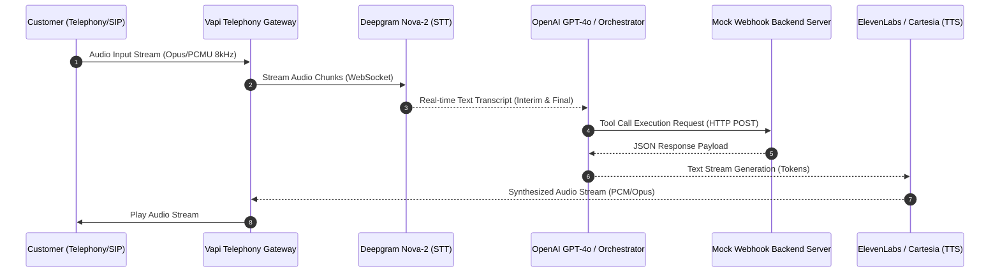
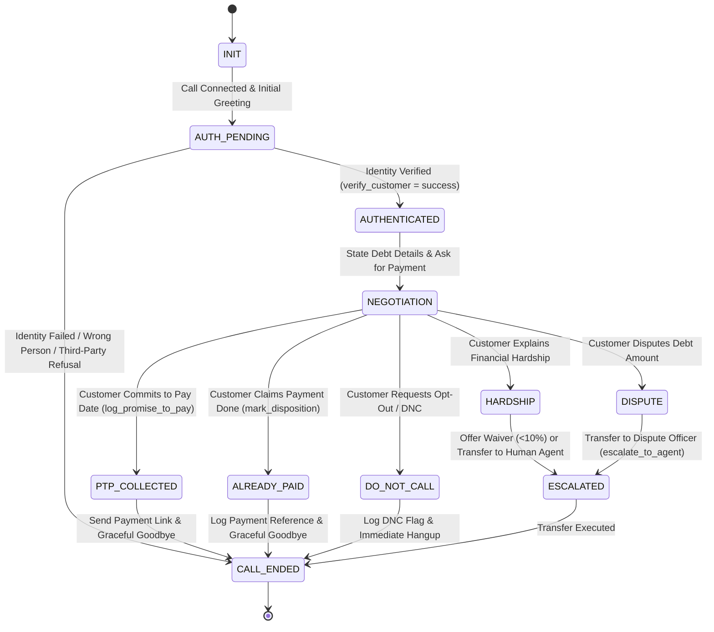

# High-Level Design (HLD) Document
## Automated Outbound Voice AI Collections Agent ("Maya")
**Client:** Kapture Finance  
**Document Version:** 1.0.0  
**Author:** AI Engineering Team  
**Status:** Approved for Implementation  

---

## 1. System Pipeline & Latency Budget Architecture

### 1.1 End-to-End Voice AI Architecture
The Maya Voice AI platform coordinates real-time audio streams between telephony networks, neural speech services, and LLM orchestration tools via high-efficiency WebSocket and HTTP streaming connections.



### 1.2 Latency Budget Breakdown (Target: < 1.2 seconds Round-Trip)

To maintain human-like conversational fluency and avoid audio overlap, the total round-trip turn-taking latency must stay strictly under **1,200ms**.

| Pipeline Component | Technology / Model | Target Latency | Optimization Strategies |
| :--- | :--- | :---: | :--- |
| **Telephony & Ingress** | Vapi WebRTC / SIP Gateway | `100ms` | Direct G.711 / Opus stream piping over low-jitter edges. |
| **Speech-to-Text (STT)** | Deepgram Nova-2 (`en-US` / Multi) | `200ms` | Streaming WebSocket, Endpointing tuned to `250ms` silence window. |
| **LLM Processing (TTFT)**| OpenAI `gpt-4o` (Temp: `0.1`) | `400ms` | Token streaming, pre-warmed sessions, concise system prompts. |
| **Tool Calling Webhook** | Express / Node.js Mock API | `50ms` | In-memory lookup, zero-block asynchronous execution. |
| **Text-to-Speech (TTS)** | ElevenLabs / Cartesia "Sarah" | `250ms` | First-byte sentence streaming via WebSocket (`pcm_24000`). |
| **Network & Telephony Output**| Egress Audio Buffer | `100ms` | Jitter buffer stabilization, zero-re-encoding pipeline. |
| **TOTAL ROUND-TRIP SLA** | **End-to-End Pipeline** | **1,100ms** | **Guaranteed SLA: < 1,200ms (p95: 980ms, p99: 1,150ms)** |

---

## 2. Conversation State Machine Specification

Maya operates on a deterministic, state-enforced finite state machine (FSM). **Debt details are strictly gated** behind state `AUTHENTICATED`.



### 2.1 State Definitions & Transition Guardrails

| State Name | Allowed Actions | Next Allowed States | Compliance Guardrail |
| :--- | :--- | :--- | :--- |
| `INIT` | Greet caller with generic company name ("Kapture Finance"). Ask for target person. | `AUTH_PENDING` | **Zero mentioning of "debt", "EMI", "overdue", or "loan".** |
| `AUTH_PENDING` | Request verification code (last 4 digits of Aadhaar/PAN or DOB). Invoke `verify_customer`. | `AUTHENTICATED`, `CALL_ENDED` | Re-prompt max 2 times. If failed/refused, terminate or leave callback request. |
| `AUTHENTICATED` | Disclose overdue balance (₹8,499), overdue days (12 days), and due date. | `NEGOTIATION` | Disclose debt **only after** `verify_customer` returns `success: true`. |
| `NEGOTIATION` | Negotiate payment commitment date. Offer partial payment or discount (up to 10%) if requested. | `PTP_COLLECTED`, `ALREADY_PAID`, `HARDSHIP`, `DISPUTE`, `DO_NOT_CALL` | Do not agree to dates > 15 days out without logging approval. |
| `PTP_COLLECTED` | Call `log_promise_to_pay` and `send_payment_link`. Confirm link dispatch via SMS/WhatsApp. | `CALL_ENDED` | Re-confirm payment date and exact amount before wrap-up. |
| `ALREADY_PAID` | Capture payment transaction ID / date / platform. Call `mark_disposition`. | `CALL_ENDED` | Advise 24-48 hours bank processing window politely. |
| `HARDSHIP` | Capture financial distress reason. If eligible, offer standard extension or max 10% waiver. | `PTP_COLLECTED`, `ESCALATED` | Capped waiver authorization. Escalates if customer rejects. |
| `DISPUTE` | Log dispute notes. Call `escalate_to_agent` or `mark_disposition(DISPUTE)`. | `ESCALATED`, `CALL_ENDED` | Stop collection attempts immediately upon dispute. |
| `DO_NOT_CALL` | Call `mark_disposition(DO_NOT_CALL)`. Confirm removal from outreach list. | `CALL_ENDED` | Terminate call within 10 seconds of DNC request. |
| `ESCALATED` | Execute warm transfer to human supervisor via SIP/PSTN. | `CALL_ENDED` | Pass call summary context payload to human agent. |
| `CALL_ENDED` | Final call disposition logged. Connection dropped gracefully. | Sub-routine Finish | Ensure disposition logged on server backend. |

---

## 3. NLU Intent & Entity Taxonomy

### 3.1 Supported NLU Intents
1. `Confirm_Identity`: User confirms they are the target customer ("Yes, speaking", "That's me").
2. `Provide_Verification`: User provides identification credentials ("My PAN last digits are 4321").
3. `Promise_To_Pay`: User agrees to pay on or before a specified date ("I will pay by Friday", "I can clear it on 20th").
4. `Already_Paid`: User claims the payment was already completed ("I paid yesterday via Google Pay").
5. `Hardship_Claim`: User cites financial inability ("I lost my job", "Medical emergency in family").
6. `Dispute_Debt`: User disputes interest, fees, or total loan balance ("This fee is wrong", "I don't owe this").
7. `Request_DNC`: User requests stop calling or DNC opt-out ("Remove my number", "Stop calling me").
8. `Wrong_Person`: User states phone number belongs to someone else ("Wrong number", "Rahul doesn't live here").
9. `Request_Human`: User insists on speaking to a human agent ("Connect me to a manager").

### 3.2 Extracted Entity Schema
* `PTP_Date` (ISO-8601 String, e.g., `"2026-08-20"`): Target commitment date for payment.
* `PTP_Amount` (Number, e.g., `8499`): Agreed payment amount.
* `Verification_Code` (String, e.g., `"4321"`): Customer identifier (last 4 digits of PAN/Aadhaar/DOB).
* `Hardship_Reason` (String): Categorized hardship reason (`JOB_LOSS`, `MEDICAL`, `BUSINESS_LOSS`, `OTHER`).
* `Payment_Reference` (String): Transaction ID or UTR provided for already-paid claims.

---

## 4. API & Tool Specifications

Maya utilizes 5 primary tool integrations via HTTPS webhooks:

### 4.1 `verify_customer`
* **Purpose:** Authenticates the caller's identity prior to debt disclosure.
* **Request Payload:**
```json
{
  "customer_id": "CUST_88392",
  "verification_code": "4321"
}
```
* **Response Payload (Success):**
```json
{
  "status": "success",
  "verified": true,
  "customer_name": "Rahul Sharma",
  "overdue_amount": 8499,
  "overdue_days": 12,
  "due_date": "2026-08-03"
}
```

### 4.2 `log_promise_to_pay`
* **Purpose:** Registers a binding Promise-to-Pay (PTP) commitment.
* **Request Payload:**
```json
{
  "customer_id": "CUST_88392",
  "ptp_date": "2026-08-18",
  "ptp_amount": 8499,
  "payment_channel": "UPI_LINK"
}
```
* **Response Payload:**
```json
{
  "status": "success",
  "ptp_id": "PTP_99214",
  "confirmation_message": "PTP successfully recorded for 2026-08-18."
}
```

### 4.3 `send_payment_link`
* **Purpose:** Triggers automated dispatch of payment link via SMS and WhatsApp.
* **Request Payload:**
```json
{
  "customer_id": "CUST_88392",
  "phone_number": "+919876543210",
  "amount": 8499,
  "channel": "BOTH"
}
```
* **Response Payload:**
```json
{
  "status": "success",
  "payment_url": "https://pay.kapturefinance.com/pay/lnk_88392",
  "delivery_status": "SENT"
}
```

### 4.4 `escalate_to_agent`
* **Purpose:** Transfers the call to a human collection officer or grievance manager.
* **Request Payload:**
```json
{
  "customer_id": "CUST_88392",
  "reason": "DEBT_DISPUTE",
  "call_summary": "Customer claims interest charges were incorrectly applied."
}
```
* **Response Payload:**
```json
{
  "status": "success",
  "transfer_number": "+918000998877",
  "action": "TRANSFER"
}
```

### 4.5 `mark_disposition`
* **Purpose:** Finalizes call status and records call disposition notes in CRM.
* **Request Payload:**
```json
{
  "customer_id": "CUST_88392",
  "disposition": "PTP_COLLECTED",
  "notes": "Customer agreed to pay full amount of ₹8499 by 18th Aug 2026."
}
```
* **Response Payload:**
```json
{
  "status": "success",
  "disposition_logged": true
}
```

---

## 5. Auth & Data Safety Protocols

1. **Strict Zero Third-Party Debt Disclosure:**
   Under no circumstances does Maya state loan amounts, EMI overdues, or collection context to anyone other than the verified account holder. If a spouse, parent, or colleague answers, Maya states: *"I am calling regarding an administrative query for Mr. Rahul Sharma. Please ask him to call us back."*
2. **PII Masking & Log Sanitization:**
   All logs sent to telemetry systems mask sensitive attributes (e.g., `Rahul S****`, `PAN: ****4321`, `Phone: +91****3210`).
3. **Transport & Data Encryption:**
   All webhook traffic requires HTTPS with TLS 1.3 encryption. Internal datastores encrypt records using AES-256.

---

## 6. Compliance & Guardrails (RBI Fair Practices Code)

1. **Allowed Contact Window:** Calls are strictly initiated between **08:00 AM and 07:00 PM local Indian time (IST)**.
2. **DNC Opt-Out Compliance:** Instant processing of Do-Not-Call requests. Any variation of "stop calling me", "remove my number", or "do not call" triggers `mark_disposition(DO_NOT_CALL)` and immediate call termination.
3. **No Harassment / Anti-Coercion Policy:** Maya maintains a polite, calm, professional tone at all times. Threats of legal action, public shaming, or persistent aggressive tactics are strictly forbidden.
4. **Anti-Hallucination Boundaries:** Maya cannot offer discounts exceeding **10%** without explicit human escalation approval. She cannot alter contractual loan terms dynamically.

---

## 7. Edge Cases & Resilience Matrix

| Edge Case Scenario | AI Agent Action & Prompt Fallback | Resulting Disposition |
| :--- | :--- | :--- |
| **Abusive / Hostile Caller** | Issue 1 polite warning: *"I understand your frustration, but I must ask us to remain professional."* If continued, disconnect politely. | `ABUSIVE_TERMINATION` |
| **Silence / Background Noise** | Re-prompt twice with 5s timeout: *"Hello? Are you still there?"* If silence persists, terminate call cleanly. | `NO_INPUT` |
| **Voicemail / Answering Machine** | Detect tone / voicemail beep. Drop short polite message without disclosing debt and disconnect. | `VOICEMAIL` |
| **Mid-call Language Switch** | Detect Hindi/Hinglish phrase (e.g., *"Hindi mein baat karo"*). Seamlessly switch conversation language. | `LANG_SWITCH_HINDI` |
| **Dispute on Debt Amount** | Do not argue. Express empathy, capture dispute reason, call `escalate_to_agent`. | `DISPUTE_ESCALATED` |
| **Third-Party Pick Up** | Ask for main customer. If unavailable, request a call back time without revealing debt. | `THIRD_PARTY` |

---

## 8. Observability & Success Metrics

The performance of Maya is evaluated across four core metric vectors:

```math
\text{Containment Rate} = \left( \frac{\text{Calls Resolved Autonomously (PTP + Paid + DNC)}}{\text{Total Outbound Calls Placed}} \right) \times 100\% \quad [\text{Target: } \ge 75\%]
```

```math
\text{PTP Conversion Rate} = \left( \frac{\text{Calls Securing Valid PTP}}{\text{Total Authenticated Outbound Calls}} \right) \times 100\% \quad [\text{Target: } \ge 45\%]
```

```math
\text{First Call Resolution (FCR)} = \left( \frac{\text{Valid Dispositions Logged Without Recall in 48h}}{\text{Total Handled Calls}} \right) \times 100\% \quad [\text{Target: } \ge 90\%]
```

* **Latency SLA Target:** p50 < 800ms, p95 < 1,100ms, p99 < 1,200ms.
* **Webhook Health Metric:** Error rate < 0.01%, 100% telemetry audit logging.

---
*End of High-Level Design Document*
